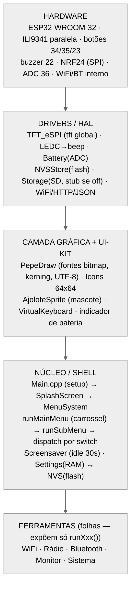
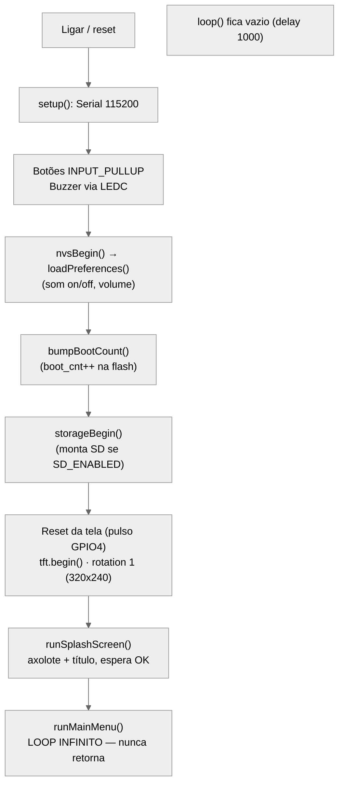
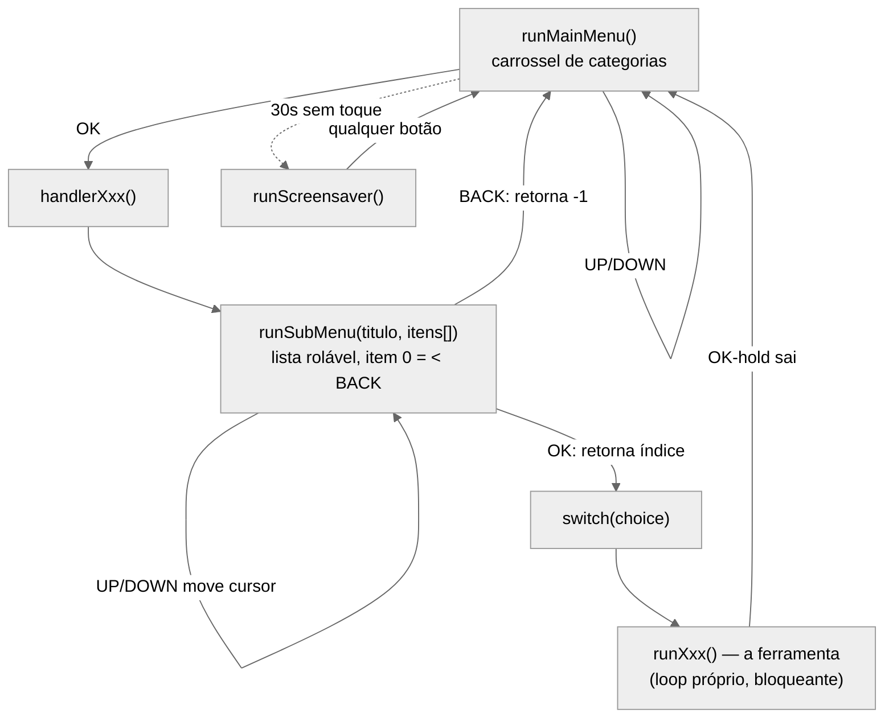
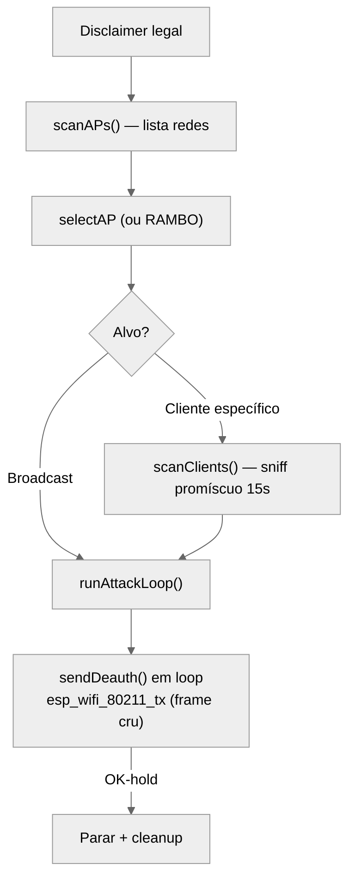
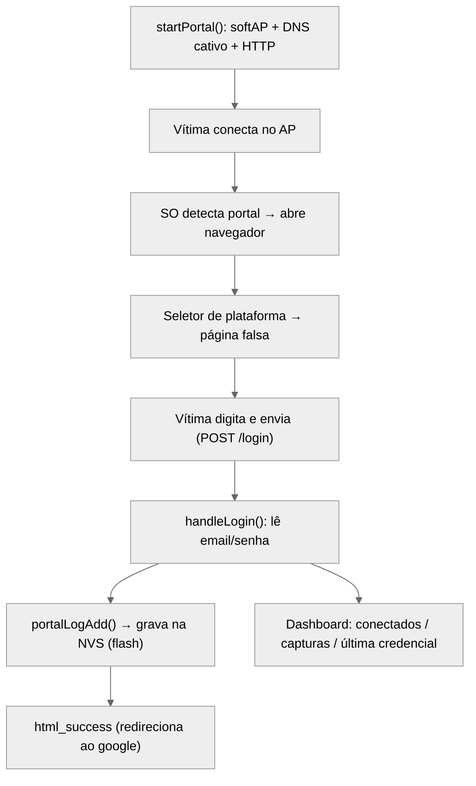
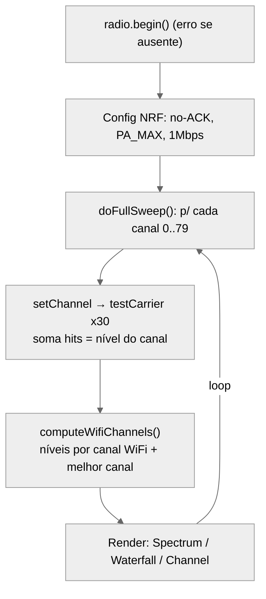

# ESP32-TOOLS — Documentação Técnica

**Manual de arquitetura, módulos e fluxos — baseado na leitura direta do código-fonte.**

> Alvo: **ESP32-WROOM-32** · Tela **ILI9341** (paralela 8-bit, via TFT_eSPI) · 3 botões (UP=34, OK=35, DOWN=23) · buzzer (GPIO22) · **NRF24L01** (SPI 25/26/33, CE=21, CSN=32) · SD e bateria opcionais.
> Framework Arduino / PlatformIO. Licença do projeto: **MIT**.

---

## 0. Como usar este manual & aviso legal

Este documento descreve **o que o firmware realmente faz por dentro**, com um compromisso de **honestidade técnica**: para cada ferramenta indicamos se ela é

- ✅ **REAL** — faz de verdade o que promete;
- 🟡 **CONDICIONAL / PARCIAL** — funciona, mas com ressalva importante (depende de patch, ou é mais limitado que o nome sugere);
- ⚠️ **ENCENAÇÃO** — a tela mostra atividade, mas o efeito real não acontece.

**Aviso legal.** Este é um firmware de **estudo / Red Team**. Atacar redes WiFi/Bluetooth, capturar credenciais ou interferir em rádio **só é legal em equipamentos e redes seus, ou com autorização por escrito**. Contra terceiros é crime no Brasil (**Lei 12.737/2012** e **Marco Civil da Internet**). **Jammers/bloqueadores são proibidos pela Anatel.** Use como laboratório.

---

## 1. Visão geral

O ESP32-TOOLS é uma **multiferramenta portátil** de segurança WiFi/Bluetooth, no espírito do Flipper Zero / ESP32 Marauder / Bruce, escrita **do zero** em C++/Arduino. Um único ESP32 controla uma tela colorida, três botões e um rádio extra (NRF24), e roda ~15 ferramentas navegáveis por menus.

**Stack de software:**

| Camada | Tecnologia |
|---|---|
| Linguagem / framework | C++ · Arduino-ESP32 (PlatformIO, `espressif32@6.4.0`) |
| Tela | `TFT_eSPI` (só primitivas) + renderizador de fontes próprio (**PepeDraw**) |
| Rádio 2.4 GHz externo | `RF24` (nrf24) |
| Rede / JSON | `WiFi`, `HTTPClient`, `ArduinoJson` (usados pelo Clock/Weather) |
| Persistência | `Preferences` (NVS/flash) + `SD` (opcional) |

---

## 2. Arquitetura de hardware

O cérebro é o **ESP32-WROOM-32** (WiFi + Bluetooth internos). A tela e o NRF24 são periféricos ligados por barramentos distintos.

### 2.1 Mapa de pinos (do `platformio.ini` e `Pins.h`)

| Função | Pinos | Barramento / obs. |
|---|---|---|
| **Tela ILI9341** | CS=5, DC=2, RST=4, WR=15, RD=-1, **D0–D7 = 12,13,14,27,16,17,18,19** | **Paralelo 8-bit** (12 pinos!) |
| **NRF24L01** | CE=21, CSN=32, SCK=25, MISO=26, MOSI=33 | SPI |
| **Botões** | UP=34, OK=35, DOWN=23 | `INPUT_PULLUP` (ativos em LOW) |
| **Buzzer** | 22 | PWM por LEDC (canal 0, 2 kHz, 8-bit) |
| **Bateria** (opcional) | ADC = 36 | divisor 2×100 kΩ; `BATTERY_MONITOR_ENABLED=0` por padrão |
| **Cartão SD** (opcional) | CS=0, compartilha SPI do NRF24 | `SD_ENABLED=0` por padrão; FAT32 |

> ⚠️ **Nota importante sobre a tela.** A configuração atual usa a ILI9341 em **modo paralelo 8-bit**, que consome **12 GPIOs** e usa um tipo de tela menos comum. A maioria das ILI9341 à venda é **SPI** (4 fios, ~5 pinos). Migrar para SPI liberaria muitos pinos para módulos futuros (CC1101, PN532) — recomendado numa evolução do projeto.

---

## 3. Arquitetura de software em camadas

O firmware é organizado em camadas com **dependência unidirecional** (o topo depende da base; a base nunca conhece o topo).



**Princípios centrais:**

- **`tft` é um singleton global** (`extern TFT_eSPI tft;`, criado no `Main.cpp`) usado por toda a camada gráfica.
- **Dispatch por ponteiro de função:** o menu principal é uma tabela de structs `MainMenuEntry { title, subtitle, icon, handler() }`. Adicionar uma categoria = incluir o header + uma entrada na tabela + um `case` no switch.
- **Contrato uniforme das ferramentas:** toda ferramenta é uma função **`void runXxx()` bloqueante** que "toma a tela", roda seu próprio loop de botões e retorna ao menu — que então se redesenha. As ferramentas **não conhecem o menu**.

---

## 4. Fluxo de boot

O `Main.cpp` é propositalmente magro: inicializa hardware e entrega o controle ao menu, que nunca retorna.



> 🔧 **Nota de qualidade:** o `Main.cpp` tem blocos duplicados por *merge* acidental (`tft.begin()` e `runMainMenu()` aparecem duas vezes). A segunda chamada de `runMainMenu()` é **código morto** (a primeira nunca retorna). Vale limpar numa próxima revisão.

---

## 5. Sistema de menus e navegação (3 botões)

O menu principal é um **carrossel vertical** de 5 categorias (WIFI, RADIO, BLUETOOTH, MONITOR, SYSTEM). Cada categoria abre um **submenu tipo lista rolável** (`runSubMenu`), e cada item da lista chama a ferramenta real.



**Como se navega com só 3 botões:**

- **UP / DOWN**: movem o cursor com *wrap-around* (do último volta ao primeiro). Cada passo emite um *beep* e uma animação de deslize (`slideAnimation`).
- **OK curto**: confirma (flash laranja de 3 pulsos + beeps, depois chama o `handler`).
- **OK longo (hold ~500 ms)**: é o "voltar/sair" universal dentro das ferramentas.
- **Inatividade de 30 s**: dispara o screensaver (axolote quicando estilo "logo de DVD").

---

## 6. Camada gráfica

### 6.1 PepeDraw — renderizador de texto próprio

A TFT_eSPI só oferece primitivas (pixels, retângulos). O **PepeDraw** é um motor de fontes **bitmap próprio** com:

- **Duas fontes** em PROGMEM: `FONT_SMALL` (5×7) e `FONT_BIG` (8×12).
- **Largura variável por caractere** (kerning real — cada glifo tem seu `width`).
- **Descenders reais** (g, j, p, q, y) e **acentos** via decodificação **UTF-8** (`nextCodepoint()`).
- Paleta de UI (RGB565): `UI_MAIN` (branco), `UI_BG` (preto), `UI_ACCENT` (cinza), `UI_SELECT` (laranja de realce).

Cada bit aceso de um glifo vira um quadrado `size×size` com `tft.fillRect()` (pixel-art escalado por blocos, sem anti-aliasing). API: `drawStringCustom`, `drawStringBig`, `drawStringCentered/Right`, `getTextWidth`.

### 6.2 Ícones e o mascote

- **Icons**: bitmaps monocromáticos **64×64** (um por categoria), com cor aplicada em runtime e *clipping* vertical (para não invadir header/footer durante o slide).
- **AjoloteSprite**: o **axolote de óculos** 🦎, mascote oficial — bitmap **96×80** em PROGMEM, com variantes (linha-a-linha para o splash, escalado, e "metade" 48×40 para o screensaver). Compartilhado por Splash, About e Screensaver.

---

## 7. Armazenamento

Há **duas camadas de persistência**:

### 7.1 NVS (flash interna) — `NVSStore`

Wrapper sobre `Preferences`, namespace único `"esp32tools"`. Guarda coisas **pequenas e persistentes** (sobrevivem a reboot/queda de energia):

| Chave | Tipo | Significado |
|---|---|---|
| `sound_on` | bool | buzzer ligado/desligado |
| `sound_vol` | int (1–5) | volume |
| `boot_cnt` | ulong | contador de boots |
| `tz_idx` | int | fuso horário manual (Clock/Weather) |
| SSID / senha WiFi | string | rede salva (WifiConfig) |
| *(namespace `evilportal`)* | bytes | **credenciais capturadas** pelo Evil Portal |

### 7.2 SD (opcional) — `Storage`

Desligado por padrão (`SD_ENABLED=0`). Compartilha o SPI do NRF24 com um CS próprio. Reservado para **arquivos grandes** (logs, dumps `.pcap`) — quando desligado, todas as funções viram **stubs neutros** (o chamador não precisa de `#ifdef`).

### 7.3 Settings — espelho em RAM

`Settings` **não é storage**: são as variáveis globais (`soundEnabled`, `soundVolume`) que espelham a NVS em runtime. No boot, `loadPreferences()` carrega da NVS; mudanças são regravadas imediatamente.

---

## 8. Ferramentas — WiFi

Todas seguem o mesmo ciclo de vida do driver: `esp_wifi_init` → `esp_wifi_start` → (uso) → `esp_wifi_deinit` no cleanup.

### 8.1 WiFi Scanner — ✅ REAL
- **O que faz:** lista redes ao redor (nome, sinal, canal, segurança) e mostra o fabricante do roteador.
- **Por dentro:** `WiFi.scanNetworks()` (API de alto nível). Tabela OUI embutida (~90 fabricantes) mapeia os 3 primeiros bytes da BSSID → fabricante. Ordena por RSSI.
- **Funções:** `runWifiScan`, `lookupVendor`, `authToString`, `rssiToBars`, `showDetails`.
- **Honestidade:** dados 100% reais; a "animação de scanning" é só um frame estático (o scan real é bloqueante).

### 8.2 Beacon Spam — 🟡 REAL (condicional a patch)
- **O que faz:** cria dezenas de redes WiFi falsas (só nomes) na lista de quem está por perto. 5 temas de nomes.
- **Por dentro:** injeta **frames Beacon 802.11** crus via `esp_wifi_80211_tx()`, com BSSID aleatório e canal no tag "DS Parameter Set". *Channel hop* 1→6→11.
- **Honestidade:** os beacons são construídos corretamente, **mas a transmissão depende do patch da lib** (ver §13). A barra de atividade é `random()` decorativo; `beaconsSent` conta chamadas de envio.

### 8.3 Deauther — 🟡 REAL (condicional a patch)
- **O que faz:** desconecta dispositivos de uma rede enviando pacotes de **deautenticação** 802.11. Modos: broadcast (todos), cliente específico, ou RAMBO (todas as redes com channel hop).
- **Por dentro:** monta frame de deauth de 26 bytes (reason code 7) e injeta via `esp_wifi_80211_tx()`. Para achar clientes, usa **modo promíscuo** filtrando frames cujo BSSID = AP alvo.



- **Honestidade:** a técnica é a real dos deauthers de ESP32. **Ressalva crítica:** sem o patch (§13), o rádio rejeita os frames silenciosamente, mas o contador `deauthPackets` continua subindo (falsa sensação de atividade).

### 8.4 Evil Portal — ✅ REAL
- **O que faz:** cria um AP falso com página de login (Facebook/Google/Instagram/TikTok/X/Netflix). Quem conecta e digita usuário/senha tem as **credenciais capturadas e salvas na flash**. Modo CLONE clona uma rede real + faz deauth em paralelo.
- **Por dentro:** `WiFi.softAP` (192.168.4.1) + **DNS cativo** (`DNSServer` responde tudo com o próprio IP) + `WebServer` na porta 80. Rotas de detecção de portal cativo (`/generate_204`, `/hotspot-detect.html`, `/ncsi.txt`). Captura via `HTTP_POST /login` lendo `email`/`password`/`platform`. HTMLs realistas em PROGMEM com `<form action="/login" method="POST">`.



- **Honestidade:** evil portal **funcional de verdade** (AP, DNS cativo e captura POST persistida em NVS funcionam **sem patch**). Só o deauth do modo CLONE herda a dependência do patch. O contador de "conectados" conta GETs na raiz, não associações DHCP — mas as **credenciais capturadas são genuínas**.

### 8.5 Probe Sniffer — ✅ REAL
- **O que faz:** escuta os *probe requests* (os pedidos que celulares emitem procurando redes conhecidas) e lista os nomes de rede buscados.
- **Por dentro:** **modo promíscuo puro** (`esp_wifi_set_promiscuous_rx_cb`, filtro MGMT). Parseia o frame (FC `0x40`), extrai o SSID, deduplica em RAM. Sem injeção — só recebe. **Funciona sem patch.**

### 8.6 Karma — 🟡 PARCIAL
- **O que faz:** captura os nomes que os celulares procuram (fase 1) e depois anuncia essas redes como abertas (fase 2), na esperança de que aparelhos se conectem.
- **Por dentro:** fase 1 = sniff de probes (igual ao Probe Sniffer); fase 2 = injeção de beacons abertos (`esp_wifi_80211_tx`) com os SSIDs capturados.
- **Honestidade:** **não é um ataque KARMA completo** — é *beacon spam dirigido*. **Não** responde probe requests com probe responses, **não** implementa associação/handshake e **não** sobe softAP para os SSIDs. O contador de "probes durante o ataque" não prova conexão de ninguém. E a transmissão depende do patch (§13).

---

## 9. Ferramentas — Rádio 2.4 GHz (NRF24L01)

Estes dois usam o **módulo NRF24 externo** (lib `RF24`), não o rádio interno. Se o `radio.begin()` falhar, mostram tela de erro com a pinagem.

### 9.1 Radio Scanner (analisador de espectro) — ✅ REAL
- **O que faz:** varre o espectro 2.4 GHz (2400–2480 MHz) e mostra 3 vistas: Spectrum (barras), Waterfall (cascata) e WiFi Channel Analyzer (recomenda o canal WiFi mais limpo).
- **Por dentro:** para cada um dos 80 canais NRF, faz `setChannel` → `startListening` → amostra `testCarrier()` (RPD, detecção de portadora >-64 dBm) 30×. Peak-hold com decay. Mapeia canais NRF↔WiFi para recomendar o melhor canal.



- **Honestidade:** dados vêm de `testCarrier()` real. É *energy/carrier detection* genuíno (não demodula pacotes, mas isso é o esperado num "espectro" com NRF).

### 9.2 Radio Jammer — 🟡 REAL (ressalva física)
- **O que faz:** transmite ruído contínuo em canais 2.4 GHz. Modos: Canal Fixo (TURBO/WIDE) e Barrido Total (varre WiFi CH1–13 + BT).
- **Por dentro:** configura o NRF em modo de saturação (`PA_MAX`, `2MBPS`, **CRC off**, no-ACK, retries 0) e martela `startWrite()` com um payload de ruído `0x55/0xAA` (máxima transição de bits).
- **Honestidade:** a transmissão é **real**. **Ressalva honesta:** um único NRF24 satura ~1 MHz de banda a poucos mW — **não "derruba" WiFi/BT de forma robusta**, especialmente no modo barrido. É proibido pela Anatel.

---

## 10. Ferramentas — Bluetooth

Estes usam o **rádio Bluetooth interno do ESP32** (stack `BLEDevice`/`esp_gap_ble_api`), não o NRF24.

### 10.1 BLE Scanner — ✅ REAL
- **O que faz:** lista dispositivos BLE por perto (MAC, RSSI, tipo de endereço, serviços, fabricante via Company ID), ordenados por sinal.
- **Por dentro:** scan BLE ativo (pede scan response); callback `onResult` faz upsert dos dispositivos e resolve o fabricante pela tabela de Company IDs (Apple 0x004C, Samsung 0x0075…). **Genuíno.**

### 10.2 BLE Spam — ✅ REAL
- **O que faz:** dispara pop-ups de pareamento falsos em celulares imitando Apple/Samsung/Microsoft/Google. Tem CHAOS mode.
- **Por dentro:** monta **payloads de advertising reais** de cada protocolo (Apple Continuity 0x07, Samsung Easy Setup, Microsoft Swift Pair, Google Fast Pair 0xFE2C), randomiza a MAC a cada pacote e emite ~50 pkt/s em potência máxima.
- **Honestidade:** advertising **genuíno**, com formatos corretos. A barra de atividade é cosmética, mas `packetsSent` é real.

### 10.3 BT Disruptor — ⚠️ ENCENAÇÃO (parcial)
- **O que faz (na tela):** ataque "dirigido" a um dispositivo escolhido, com modos *Connect Flood*, *L2CAP Ping Storm*, *Spoof Identity*, *Chaos*.
- **O que faz de verdade:** apenas **BLE advertising com payload aleatório** — a mesma mecânica do BLE Spam, com nomes agressivos.
  - *Connect Flood* e *L2CAP Storm* **não existem**: só preenchem buffers com `random()` + alguns bytes da MAC do alvo. **Nenhuma conexão é aberta** (`BLEClient.h` é incluído mas nunca instanciado); **nenhum pacote L2CAP** é gerado.
  - Só *Spoof Identity* realmente usa a MAC do alvo (via `esp_ble_gap_set_rand_addr`).
- **Honestidade:** o scan de alvos e a transmissão de advertisement são reais, mas os "ataques" nomeados **não são implementados** e o alvo em geral **não é afetado** (advertisement broadcast não derruba terceiros). O contador conta atualizações de buffer, não transmissões. **É o principal caso de "teatro" do firmware.**

---

## 11. Monitor — Packet Monitor — ✅ REAL (calibração estética)
- **O que faz:** mede o "tráfego no ar" — pacotes por segundo num canal — com velocímetro, histórico de 60 s, nível (QUIET→FLOODED) e som ambiente.
- **Por dentro:** callback promíscuo minimalista que **incrementa um contador para cada frame** recebido. A cada segundo converte em pps e classifica.
- **Honestidade:** a **contagem é real** (frames 802.11 recebidos). Os limiares e o rótulo "FLOODED = provável jamming" são heurística estética, e o som é cosmético — mas nenhum número é falsificado.

---

## 12. Sistema — utilitários

- **Settings** (`runSettings`) — 🟡/✅ SOUND (grava `sound_on`), VOLUME (1–5, grava `sound_vol`), TIMEZONE, FORGET WIFI. Cada mudança persiste na NVS na hora.
- **System Info** — ✅ dados reais do chip (modelo, cores, freq, flash, MACs WiFi/BT, heap, uptime, `boot_cnt`). ⚠️ **exceção:** a *temperatura interna* (`temprature_sens_read`) é imprecisa/não calibrada — valor apenas indicativo.
- **Clock / Weather** — ✅ **usa rede de verdade**: WiFi (WifiConfig) → geolocalização por IP (`ip-api.com`) → NTP (`configTzTime`) → clima (`api.open-meteo.com`, sem API key). ⚠️ Se algo falhar, cai em *fallbacks* (cidade fixa Los Mochis/MX, clima zerado) — degradação, não invenção.
- **About** — ✅ créditos roláveis com o axolote. Puramente informativo.
- **Splash / Screensaver** — a splash tem "loading steps" que são ⚠️ **puramente cosméticos** (a init real já ocorreu no `setup()`); o screensaver é o axolote quicando.

---

## 13. ⚠️ A dependência crítica do patch (leia com atenção)

Três ferramentas — **Deauther, Beacon Spam e Karma** — precisam **injetar frames 802.11 crus** via `esp_wifi_80211_tx()`. O SDK do ESP32 **bloqueia** esses frames através da função `ieee80211_raw_frame_sanity_check()`.

O projeto contorna isso com um *override* em C (em `Deauther.cpp`) que retorna 0 — **mas ele só surte efeito se um patch manual de compilação for aplicado**:

```
objcopy --weaken-symbol=ieee80211_raw_frame_sanity_check libnet80211.a
```

(documentado no `README.md` e em `parche para deauth funcional.txt`).

> **Sem esse patch, os frames são rejeitados silenciosamente pelo rádio — porém os contadores na tela (`deauthPackets`, `beaconsSent`) continuam subindo.** É exatamente o ponto onde **"a tela mente"**: parece funcionar, mas nada é transmitido.

**Não dependem do patch** (funcionam sempre): WiFi Scanner, Probe Sniffer, Packet Monitor, **Evil Portal** (captura), BLE Scanner, BLE Spam, Radio Scanner, Radio Jammer.

---

## 14. Tabela mestra de honestidade

| Ferramenta | Rádio/HW | Status | Observação |
|---|---|---|---|
| WiFi Scanner | WiFi interno | ✅ REAL | scan + OUI |
| Beacon Spam | WiFi interno | 🟡 depende do patch | senão não transmite |
| Deauther | WiFi interno | 🟡 depende do patch | técnica real |
| **Evil Portal** | WiFi interno | ✅ REAL | captura salva na flash |
| Probe Sniffer | WiFi interno | ✅ REAL | só recebe |
| Karma | WiFi interno | 🟡 PARCIAL | beacon spam, não KARMA real |
| Radio Scanner | **NRF24** | ✅ REAL | carrier detection |
| Radio Jammer | **NRF24** | 🟡 REAL | eficácia física limitada |
| BLE Scanner | BT interno | ✅ REAL | scan genuíno |
| BLE Spam | BT interno | ✅ REAL | advertising real |
| **BT Disruptor** | BT interno | ⚠️ ENCENAÇÃO | ataques nomeados não implementados |
| Packet Monitor | WiFi interno | ✅ REAL | contagem real |
| Clock/Weather | WiFi interno | ✅ REAL | APIs reais + fallback |
| System Info | — | ✅ REAL | exceto temperatura |

**Resumo:** o firmware é **majoritariamente honesto** — bem mais sério que o marketing (não há "iPhone unlock" no código). Os pontos a corrigir para 100% de integridade são: **(1)** deixar claro/garantir o patch nos três injetores; **(2)** reescrever o **BT Disruptor** para fazer o que anuncia (ou renomear honestamente); **(3)** completar o **Karma** (probe responses + associação) ou renomear para "Beacon Spam dirigido"; **(4)** só incrementar contadores quando o TX realmente ocorre.

---

## 15. Notas de qualidade de código (para a evolução)

- **`Main.cpp`**: blocos duplicados por merge (`tft.begin`, `runMainMenu` repetidos) — a 2ª `runMainMenu()` é inalcançável.
- **Parsing de probe requests duplicado** (copy-paste) entre `ProbeSniffer` e `Karma` — candidato a função compartilhada.
- **Contadores incondicionais**: `deauthPackets++`, `beaconsSent++`, `g_clientsConnected++` incrementam sem checar o resultado real — deveriam refletir sucesso.
- **Barras `random()`** decorativas em vários `drawAttackStats()`/`drawBars()` — inofensivas, mas confundem quem lê a tela como métrica.

---

## 16. Glossário rápido

- **Promíscuo (monitor mode):** modo em que o rádio entrega *todos* os pacotes do ar, não só os destinados a você. Base de sniffers.
- **Frame injection:** montar e transmitir pacotes 802.11 crus (deauth, beacon) — no ESP32 exige o patch da §13.
- **Beacon:** quadro que um AP emite anunciando uma rede. "Beacon spam" = fabricar muitos.
- **Probe request:** quadro que um cliente emite procurando redes conhecidas.
- **Captive portal (portal cativo):** página de login forçada ao conectar num WiFi — a base do Evil Portal.
- **RPD / carrier detect:** o NRF24 indica se há portadora acima de um limiar num canal — vira o "espectro".
- **NVS:** *Non-Volatile Storage*, a partição de flash do ESP32 onde ficam preferências e credenciais.

---

*Documentação técnica gerada a partir da análise direta do código-fonte do repositório ESP32-TOOLS. Projeto sob licença MIT; mascote axolote 🦎 por PepeAngell.*
